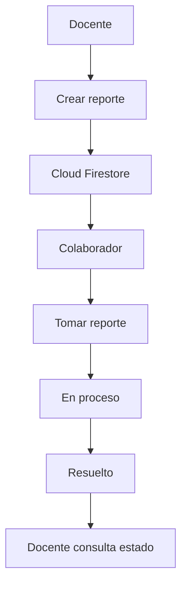

<div align="center">

#  FixUAM

### Sistema móvil para la gestión de incidencias tecnológicas en aulas universitarias

FixUAM es una aplicación móvil desarrollada en **Kotlin** con **Jetpack Compose** que permite a los docentes reportar incidencias tecnológicas dentro de las aulas universitarias, facilitando su atención por parte del personal técnico mediante una plataforma centralizada, moderna y sincronizada en tiempo real.

<br>


<br>

###  Color principal

`#32A0A6`

</div>

---

#  Descripción

FixUAM nace como una solución para optimizar la comunicación entre los docentes y el personal de soporte tecnológico de la Universidad Americana (UAM).

En muchos casos, cuando ocurre una falla tecnológica durante una clase, el docente debe recurrir a llamadas telefónicas, mensajes personales o comunicación verbal para solicitar ayuda. Esto genera retrasos, desorganización y dificulta el seguimiento de cada incidencia.

Con FixUAM, el docente puede crear un reporte desde su dispositivo móvil indicando:

- Tipo de incidencia.
- Aula donde ocurrió.
- Descripción del problema.
- Evidencia fotográfica.

Una vez enviado, el reporte se almacena en **Cloud Firestore**, permitiendo que el colaborador técnico lo visualice inmediatamente desde otro dispositivo, lo tome para su atención y actualice su estado hasta marcarlo como resuelto.

---

#  Problema que resuelve

Actualmente las incidencias tecnológicas suelen reportarse mediante canales informales, lo que provoca:

| Problema | Consecuencia |
|----------|--------------|
| Falta de un canal único | Reportes perdidos o duplicados |
| Comunicación informal | Desorganización en la atención |
| Sin seguimiento | El docente desconoce el estado del reporte |
| Sin evidencia visual | El técnico desconoce el problema antes de llegar |
| Sin historial | No existe control de incidencias |

FixUAM centraliza todo este proceso mediante una aplicación móvil intuitiva y colaborativa.

---

#  Objetivo general

Desarrollar una aplicación móvil que permita registrar, administrar y dar seguimiento a incidencias tecnológicas dentro de las aulas universitarias, facilitando la comunicación entre docentes y personal técnico.

---

#  Objetivos específicos

- Permitir el registro y autenticación de usuarios.
- Crear reportes tecnológicos desde dispositivos móviles.
- Adjuntar evidencia fotográfica.
- Administrar el estado de cada incidencia.
- Permitir que el personal técnico atienda reportes.
- Sincronizar la información entre múltiples dispositivos.
- Aplicar Programación Orientada a Objetos.
- Implementar una interfaz moderna con Jetpack Compose.
- Utilizar Firebase como plataforma backend.

---

#  Tecnologías utilizadas

| Tecnología | Descripción |
|------------|-------------|
| Kotlin | Lenguaje principal |
| Jetpack Compose | Desarrollo de interfaces declarativas |
| Material Design 3 | Componentes visuales |
| Firebase Authentication | Registro e inicio de sesión |
| Cloud Firestore | Base de datos NoSQL en tiempo real |
| Activity Result API | Cámara y galería |
| Android Studio | Entorno de desarrollo |
| Git | Control de versiones |
| GitHub | Repositorio del proyecto |

---

#  Arquitectura del proyecto

Actualmente el proyecto se encuentra organizado por responsabilidades.

```text
app
│
├── navigation
├── screens
├── ui
│   └── theme
├── FirebaseServicio
├── componentes reutilizables
└── modelos
```

Esta estructura facilita el mantenimiento, la reutilización del código y futuras migraciones hacia una arquitectura MVVM.

---

# Base de datos

La aplicación utiliza **Cloud Firestore** para almacenar la información de forma remota.

Actualmente existen dos colecciones principales.

## Usuarios

```text
usuarios
│
├── uid
│     ├── nombre
│     ├── correo
│     ├── rol
│     ├── facultad
│     └── cif
```

## Reportes

```text
reportes
│
├── id
│     ├── docente
│     ├── docenteUid
│     ├── tipo
│     ├── aula
│     ├── descripcion
│     ├── prioridad
│     ├── estado
│     ├── fecha
│     ├── atendidoPor
│     ├── atendidoPorUid
│     └── fotoUri
```

---

#  Sincronización en tiempo real

Gracias a Cloud Firestore, la información se sincroniza automáticamente entre todos los dispositivos conectados.

Esto permite que:

- Un docente cree un reporte desde un dispositivo.
- El colaborador lo visualice inmediatamente desde otro dispositivo.
- El administrador consulte todos los reportes existentes.
- Los cambios de estado se reflejen automáticamente para todos los usuarios.

---

#  Roles del sistema

| Rol | Estado | Funciones |
|------|---------|-----------|
|  Docente |  Implementado | Crear reportes, consultar historial, cancelar reportes. |
|  Colaborador |  Implementado | Visualizar, tomar y resolver reportes. |
|  Administrador | 🟡 Implementado parcialmente | Visualización general de reportes. Funciones administrativas en desarrollo. |

---

#  Funcionalidades implementadas

| Funcionalidad | Estado |
|--------------|--------|
| Registro de usuarios | 🟢 |
| Inicio de sesión con Firebase | 🟢 |
| Validación por roles | 🟢 |
| Cierre de sesión | 🟢 |
| Creación de reportes | 🟢 |
| Adjuntar imágenes | 🟢 |
| Capturar fotografía | 🟢 |
| Historial de reportes | 🟢 |
| Consulta del estado | 🟢 |
| Cancelación de reportes | 🟢 |
| Panel del colaborador | 🟢 |
| Tomar reportes | 🟢 |
| Cambiar estado del reporte | 🟢 |
| Dashboard administrativo | 🟢 |
| Sincronización en tiempo real | 🟢 |
| Modo claro y oscuro | 🟢 |
| Fondo animado | 🟢 |
| Transiciones entre pantallas | 🟢 |
| Firebase Storage | 🟠 En desarrollo |
| Estadísticas | 🟠 En desarrollo |
| Arquitectura MVVM | 🟠 En desarrollo |

---

#  Flujo general



---

#  Diseño de interfaz

La aplicación sigue una línea visual moderna basada en Material Design 3.

## Paleta principal

| Elemento | Color |
|----------|--------|
| Principal | `#32A0A6` |
| Fondo | `#F4FAFB` |
| Texto | `#102A43` |
| Texto secundario | `#7A8A99` |
| Pendiente | 🔴 |
| En proceso | 🟠 |
| Resuelto | 🟢 |

Características principales:

- Tarjetas redondeadas.
- Fondo animado.
- Componentes Material 3.
- Modo claro y oscuro.
- Navegación fluida.
- Diseño responsivo.
- Formularios intuitivos.

---

#  Conceptos aplicados

Durante el desarrollo se aplicaron conceptos de:

- Programación Orientada a Objetos (POO).
- Modularización.
- Encapsulamiento.
- Reutilización de componentes.
- Separación de responsabilidades.
- Gestión de estado con Jetpack Compose.
- Autenticación mediante Firebase Authentication.
- Persistencia de datos con Cloud Firestore.
- Navegación entre pantallas.
- Interfaces declarativas con Compose.

---

#  Estado del proyecto

Actualmente FixUAM permite que varios dispositivos interactúen sobre la misma base de datos utilizando Firebase, posibilitando el registro de incidencias, su atención por parte del personal técnico y el seguimiento de su estado en tiempo real.

El proyecto continúa en desarrollo con futuras mejoras como:

- Firebase Storage para almacenar imágenes.
- Arquitectura MVVM.
- Sistema de notificaciones.
- Estadísticas administrativas.
- Gestión avanzada de usuarios.
- Panel administrativo completo.

---

<div align="center">

### Desarrollado como proyecto académico utilizando Kotlin, Jetpack Compose y Firebase.


</div>
